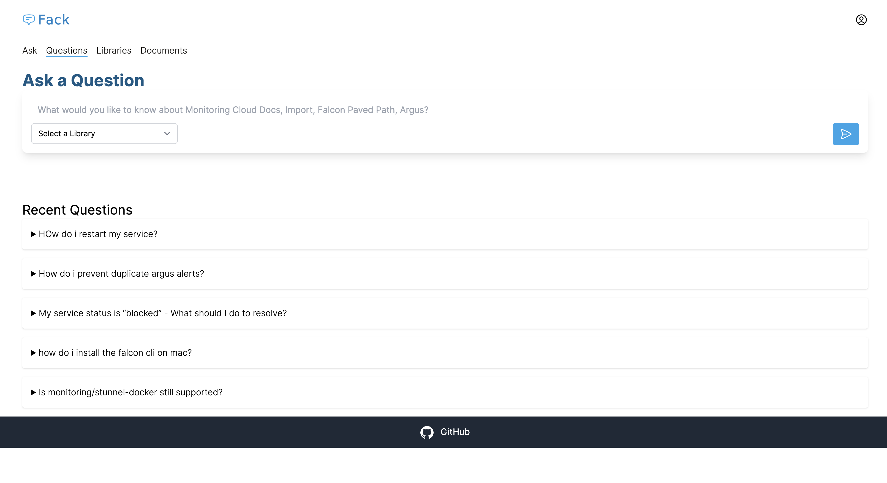
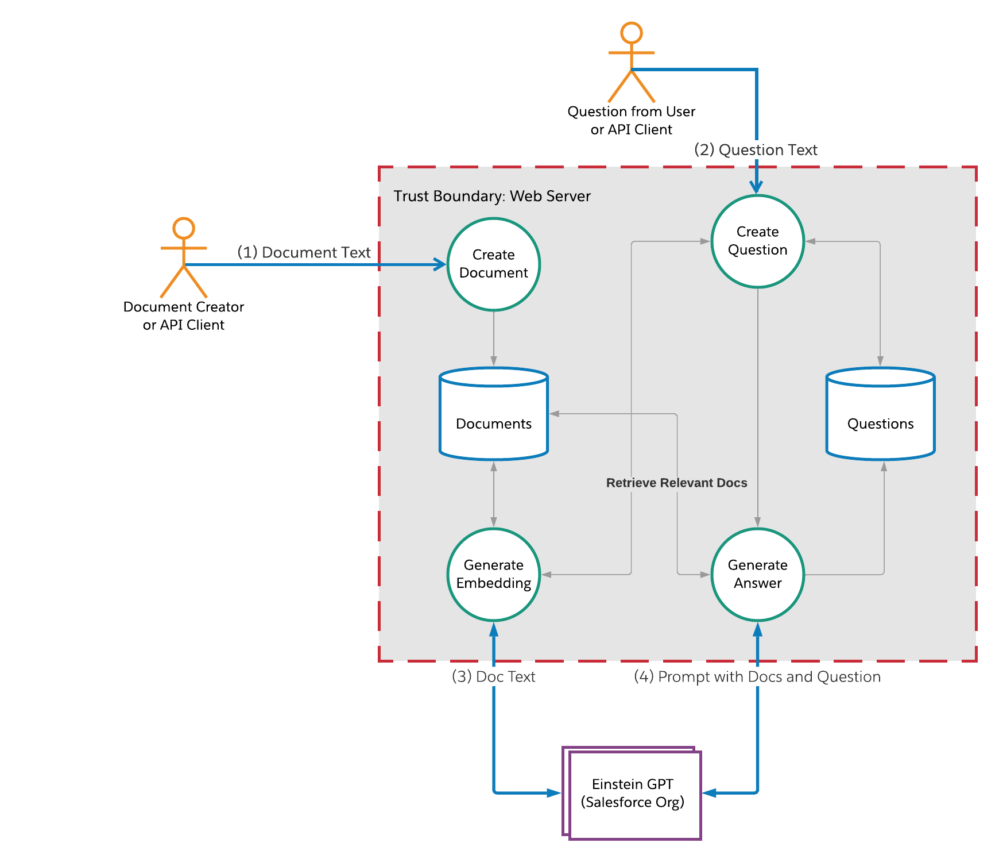

# What is Fack?
Fack aims to answer frequently asked questions using Generative AI.
Here is an example:


## Use Cases
- Enable ChatGPT-like interface on your internal documents
- Provide backend for chat bot question/answer service

## Why is it Called Fack?
The term FAQ, or Frequently Asked Questions, is often pronounced [fack](https://english.stackexchange.com/questions/4165/what-is-the-commonly-accepted-pronunciation-of-faq).

## Inspiration
Fack is built on the principles outlined by OpenAI for question/answer applications in documents like:
- https://platform.openai.com/docs/tutorials/web-qa-embeddings
- https://github.com/openai/openai-cookbook/blob/main/examples/Question_answering_using_embeddings.ipynb


## Benefits of Fack

### APIs
Reuse your documents across multiple systems.
Need a Q/A interface? Done.  Need to provide answers in a chat bot? Done.

### Shared AI Knowledge
Working with LLMs is deceptively complex.
Vector embeddings, token counting, effective prompting all require thought to make effective use of LLMs.
By having a shared service, you can have one service to manage retrieval-augmented search and ask queries.

### Deduplication
When managing thousands of documents, managing documents is difficult.  Are their duplicates?  What are the groups of documents?

### Document Grouping
All documents are not equal.  You have different groups within your company and organization.  Different teams need to manage their documents.
Visibilty may be an issue.

# Principles
1. __Open Source__.  This should be reusable as far as possible.  Nothing in the tool should be hardcoded to Salesforce or any team in Salesforce.  The tool has clear deployment and development instructions.
2. __API first__.  The end user interactions will likely happen through other bots and applications.  So, the service should be API first.
3. __Multi-tenant__.  Different teams should be able to share the same technology, without mixing their data.

# Design

## Data Flow


## Why Search is Better than Fine-tuning
The [OpenAI doc](https://cookbook.openai.com/examples/question_answering_using_embeddings#why-search-is-better-than-fine-tuning) outlines the reasons why search/retrieval is typically better than fine-tuning.
- "Fine-tuning is better suited to teaching specialized tasks or styles, and is less reliable for factual recall."
- Search/retrival enables more reliable source citation.  We can provide specific documents with urls/names to the GPT and require references to the documents used for answering the question.  In fine-tuning, the original source is most likely lost or unavailable.


# Developers

## Requirements
- Rails 7
- Ruby 3+
- Postgres with pg_vector support

## Running Locally
1. Clone the repo
```
git clone https://github.com/salesforce/fack.git
```
2. Install dependencies
```
bundle
```
3. Database creation/migration
```
rails db:create
rails db:migrate
```
4. Create a .env file in the root directory.  Provide these variables.
```
# REQUIRED
SALESFORCE_CONNECT_ORG_URL=
SALESFORCE_CONNECT_CLIENT_ID=
SALESFORCE_CONNECT_CLIENT_SECRET=
SALESFORCE_CONNECT_USERNAME=
SALESFORCE_CONNECT_PASSWORD=

# https://fack.yourdomain.com.  Used to generate URLs in the answers.
ROOT_URL=

# OPTIONAL
## SAML/SSO Metadata URL
SSO_METADATA_URL=

## Max number of document tokens to send to the GPT prompt. GPT 3.5 can handle 1 
MAX_PROMPT_DOC_TOKENS=

## Max tokens to send in the prompt
EGPT_MAX_TOKENS=

## Which OpenAI model to use.
EGPT_GEN_MODEL=

## Disable Password Login if you have SSO enabled.  (true/false)
DISABLE_PASSWORD_LOGIN=
```
5. Start
```
rails s
```

Open http://localhost:3000

## Testing
```
bundle exec rspec
```

The tests are located under the `spec` directory.


# Usage

# UI
Coming soon

# API

------------------------------------------------------------------------------------------

#### Questions

<details>
 <summary><code>POST</code> <code><b>/api/v1/questions</b></code> <code>Create a new Question (Ask AI for answer)</code></summary>

##### Parameters

> | name      |  type     | data type               | description                                                           |
> |-----------|-----------|-------------------------|-----------------------------------------------------------------------|
> | question  |  required | text                    | The question to ask of the documentation   |
> | library_ids  |  optional | comma separated ids (reference to library)            | The libraries to limit the answers   |    


##### Responses

> | http code     | content-type                      | response                                                            |
> |---------------|-----------------------------------|---------------------------------------------------------------------|
> | `201`         | `text/plain;charset=UTF-8`        | `Question created successfully`                                     |
> | `400`         | `application/json`                | `{"code":"400","message":"Bad Request"}`                            |

##### Example cURL

> ```javascript
> curl -X POST -H "Authorization: Bearer <token>" -H "Content-Type: application/json" -d '{"question": { "question" : "how do i setup falcon?"}}' http://localhost:3000/api/v1/questions
> ```

> ```javascript
>{
>   "id": 226,
>   "question": "how do i setup falcon?",
>   "status":"generating",
>   "answer": "# ANSWER\nTo set up Falcon, you need to install the Falcon CLI. Here are the steps to install the Falcon CLI:\n\n1. For macOS users, install the Falcon CLI with brew:\n   ```\n   brew tap sfdc-falcon/cli git[@git.soma.salesforce.com:sfdc-falcon/>homebrew-cli.git](https://git.soma.salesforce.com/git.soma.salesforce.com:sfdc-falcon/homebrew-cli.git)\n   brew install falcon-cli\n   ```\n\n2.  For Linux users, install the Falcon CLI with `curl`:\n   ```\n   curl -sSL https://sfdc.co/get-falcon-cli | bash\n   ```\n\n3. Verify that you've successfully installed the CLI by logging in:\n   ```\n   falcon login\n   ```\n\nYou can find more information about setting up the Falcon CLI in the [Install the Falcon Command Line Interface (CLI)](https://git.soma.salesforce.com/tech-enablement/falcon-paved-path/blob/main/install-falcon-cli.md) document.\n\n# SOURCES\n- [Install the Falcon Command Line Interface (CLI)](https://git.soma.salesforce.com/tech-enablement/falcon-paved-path/blob/main/install-falcon-cli.md)",
>   "created_at": "2023-11-03T17:28:43.625Z",
>   "updated_at": "2023-11-03T17:28:43.625Z",
>   "url": "http://localhost:3000/questions/226.json"
>}
> ```

</details>
    
    
<details>
 <summary><code>GET</code> <code><b>/api/v1/questions/<id></b></code> <code>Retrieve Question</code></summary>

##### Parameters

> | name      |  type     | data type               | description                                                           |
> |-----------|-----------|-------------------------|-----------------------------------------------------------------------|


##### Responses

> | name      |  type     | data type               | description                                                           |
> |-----------|-----------|-------------------------|-----------------------------------------------------------------------|
> | question  |   | text                    | The question to ask of the documentation   |
> | status  |   | pending, generating, generated, failed         | The status of the generated answer.  Poll every 5 seconds until the status is generated or failed.   |    
> | able_to_answer  |   |  boolean        | Was the GPT able to generate an answer? (true/false)  |    


> | http code     | content-type                      | response                                                            |
> |---------------|-----------------------------------|---------------------------------------------------------------------|
> | `201`         | `text/plain;charset=UTF-8`        | `Question created successfully`                                     |
> | `400`         | `application/json`                | `{"code":"400","message":"Bad Request"}`                            |

##### Example cURL

> ```javascript
> curl -X GET -H "Authorization: Bearer <token>"  http://localhost:3000/api/v1/questions/226
> ```

> ```javascript
>{
>   "id": 226,
>   "question": "how do i setup falcon?",
>   "status":"generated",
>   "answer": "# ANSWER\nTo set up Falcon, you need to install the Falcon CLI. Here are the steps to install the Falcon CLI:\n\n1. For macOS users, install the Falcon CLI with brew:\n   ```\n   brew tap sfdc-falcon/cli git[@git.soma.salesforce.com:sfdc-falcon/>homebrew-cli.git](https://git.soma.salesforce.com/git.soma.salesforce.com:sfdc-falcon/homebrew-cli.git)\n   brew install falcon-cli\n   ```\n\n2.  For Linux users, install the Falcon CLI with `curl`:\n   ```\n   curl -sSL https://sfdc.co/get-falcon-cli | bash\n   ```\n\n3. Verify that you've successfully installed the CLI by logging in:\n   ```\n   falcon login\n   ```\n\nYou can find more information about setting up the Falcon CLI in the [Install the Falcon Command Line Interface (CLI)](https://git.soma.salesforce.com/tech-enablement/falcon-paved-path/blob/main/install-falcon-cli.md) document.\n\n# SOURCES\n- [Install the Falcon Command Line Interface (CLI)](https://git.soma.salesforce.com/tech-enablement/falcon-paved-path/blob/main/install-falcon-cli.md)",
>   "created_at": "2023-11-03T17:28:43.625Z",
>   "updated_at": "2023-11-03T17:28:43.625Z",
>   "url": "http://localhost:3000/questions/226.json"
>}
> ```

</details>
     
#### Documents
     
<details>
 <summary><code>POST</code> <code><b>/api/v1/documents</b></code> <code>Create a new Document</code></summary>

##### Parameters

> | name      |  type     | data type               | description                                                           |
> |-----------|-----------|-------------------------|-----------------------------------------------------------------------|
> | document  |  required | text                    | The question to ask of the documentation   |
> | library_id  |  required | valid library id (reference to library)            |  |    
> | external_id  |  optional | text          | a unique id provided by the client.  If a POST request has the same external_id as an existing record, the record will be updated instead of created.  |    


##### Responses

> | http code     | content-type                      | response                                                            |
> |---------------|-----------------------------------|---------------------------------------------------------------------|
> | `201`         | `text/plain;charset=UTF-8`        | `Question created successfully`                                     |
> | `400`         | `application/json`                | `{"code":"400","message":"Bad Request"}`                            |

##### Example cURL

> ```javascript
>  curl -X POST -H "Authorization: Bearer <token>" --data @document.json <HOST>/api/v1/documents
> ```

</details>
    
    
<details>
 <summary><code>GET</code> <code><b>/api/v1/documents/<id></b></code> <code>Retrieve Document</code></summary>

##### Parameters

> | name      |  type     | data type               | description                                                           |
> |-----------|-----------|-------------------------|-----------------------------------------------------------------------|


##### Responses

> | http code     | content-type                      | response                                                            |
> |---------------|-----------------------------------|---------------------------------------------------------------------|
> | `201`         | `text/plain;charset=UTF-8`        | `Question created successfully`                                     |
> | `400`         | `application/json`                | `{"code":"400","message":"Bad Request"}`                            |

##### Example cURL

> ```javascript
>  curl -X GET -H "Authorization: Bearer <token>" <HOST>/api/v1/documents/<id>
> ```

</details>

     
#### Libraries
     
<details>
 <summary><code>POST</code> <code><b>/api/v1/libraries</b></code> <code>Create a new Library</code></summary>

##### Parameters

> | name      |  type     | data type               | description                                                           |
> |-----------|-----------|-------------------------|-----------------------------------------------------------------------|
> | name  |  required | text                    | The name of the library   | 


##### Responses

> | http code     | content-type                      | response                                                            |
> |---------------|-----------------------------------|---------------------------------------------------------------------|
> | `201`         | `text/plain;charset=UTF-8`        | `Question created successfully`                                     |
> | `400`         | `application/json`                | `{"code":"400","message":"Bad Request"}`                            |

##### Example cURL

> ```javascript
>  curl -X POST -H "Authorization: Bearer <token>" --data @library.json <HOST>/api/v1/libraries
> ```

</details>
    
    
<details>
 <summary><code>GET</code> <code><b>/api/v1/library/<id></b></code> <code>Retrieve Library</code></summary>

##### Parameters

> | name      |  type     | data type               | description                                                           |
> |-----------|-----------|-------------------------|-----------------------------------------------------------------------|


##### Responses

> | http code     | content-type                      | response                                                            |
> |---------------|-----------------------------------|---------------------------------------------------------------------|
> | `201`         | `text/plain;charset=UTF-8`        | `Question created successfully`                                     |
> | `400`         | `application/json`                | `{"code":"400","message":"Bad Request"}`                            |

##### Example cURL

> ```javascript
>  curl -X GET -H "Authorization: Bearer <token>" <HOST>/api/v1/libraries/<id>
> ```

</details>

# Guides

## Setup SSO
1. Get the SSO Metadata URL from your SSO provider.  i.e. https://company.okta.com/app/xyz/sso/saml/metadata
2. Set the SSO_METADATA_URL to the url from previous step in your .env file or environment.
3. Restart your app.
4. Optionally, disable username/password login with DISABLE_PASSWORD_LOGIN=true environment variable.

## Importing Your Documents (DRAFT)

### 1. Choose or Create a Library
The library is a collection of similar documents.  For example:
- Infrastructure
- Dev Docs
- Onboarding

The library allows document owners to keep their documents separate from each other.  It also enables more selective question/answers.

#### Existing Library
1. Go to /libraries in the UI
2. Locate the library you want.
3. Note the id in the URL.

#### Creating a Library
1. Go to /libraries in the UI
2. Click "New Library" button.
3. Provide a name and save.
Get the id of the library from the URL.

### 2. Get an API Token
1. Open /api_tokens in the ui.
2. Create a token.

### 3. Locate the Directory with your Documents
You can clone your doc repo or have an directory anywhere on your computer.

### 4. Run the import script
```
./import.sh -u http://localhost:3000 -d <path_to_your_docs> -l <library_id> -t <your_token>
```

### 5. Verify and Test
1. Go to /libraries and click on the library you used.
2. See if the documents from your import are listed.